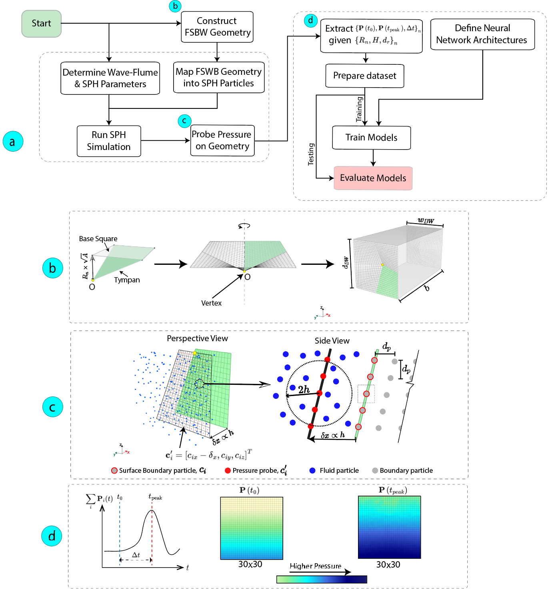
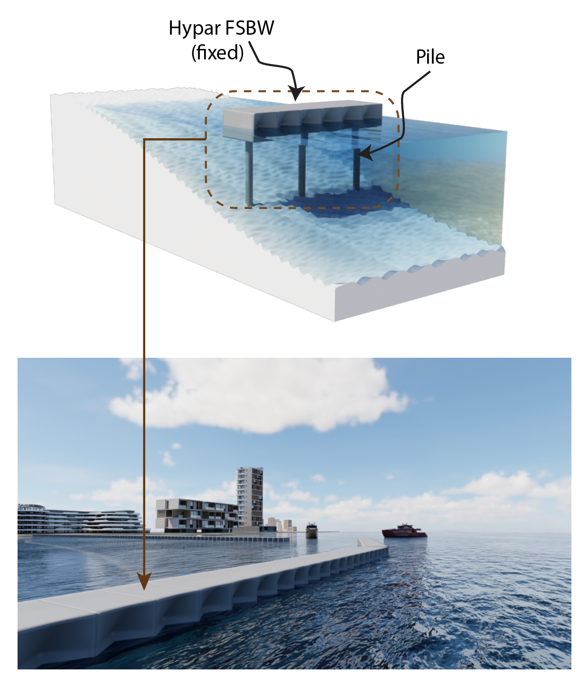

# Hypar_NeuralNetwork_SPH 
Neural-network surrogates for predicting wave-induced pressure distributions on hyperbolic paraboloid free-surface breakwaters (FSBWs) using SPH simulation data.



*SPH–Neural methodology for predicting wave pressure distribution on hypar FSBWs. (a) Workflow from hypar FSBW geometry generation and SPH analysis to neural networks evaluation. (b) Parametric hypar geometry (Rhino/Grasshopper) with warping described by normalized rise, R_n. (c) Seaside pressure probing in SPH on. (d) Post-processing for extracting target outputs.*



*Rendering of a fixed, pile-supported hypar FSBW array, leeside protected region (e.g., harbor/marina) to the left and seaward to the right.*

## Repository structure

- `src/` Python modules for data loading, preprocessing, model definitions, training, and evaluation.
- `data/` SPH datasets 

## Installation

```bash
pip install -r requirements.txt
```

## Usage

- **Train**

```bash
python -m src.train --model=cnn --epochs=100 --device=cuda:0
```

- **Available models**: `fnn`, `cnn`, `deeponet`

- **Evaluate**

```bash
python -m src.evaluate --device=cuda:0
```

## Abstract

**Neural Network-Based Prediction of Wave Pressure Distribution on Hyperbolic Paraboloid Surfaces**  
Sam Smith, Gaoyuan Wu, Maria Garlock  
Department of Civil and Environmental Engineering, Princeton University, Princeton, NJ 08544, United States

Recent studies have demonstrated the potential of hyperbolic paraboloid (hypar), a doubly curved geometry, in coastal engineering applications. Predicting pressure distribution, critical for subsequent finite element analysis, on such novel 3D structures require Computational Fluid Dynamics (CFD) simulations, which are computationally intensive. To address this challenge, the current study develops an artificial neural-network (ANN) surrogate to predict pressure distributions on hypar free-surface breakwaters (FSBW) under solitary wave loading. Using Smoothed Particle Hydrodynamics (SPH) as the CDF tool, simulations generate the supervised learning dataset, where inputs are the hypar warping \(R_n\), breakwater draft \(d_r\), and wave height H. The targets consist of two 30×30 pressure maps at wave arrival (hydrostatic) and peak, together with the wave rise time \(\{P(t_0), P(t_{\text{peak}}), \Delta t\}\) with \(\Delta t = t_{\text{peak}} - t_0\). Three architectures, FNN, CNN, and DeepONet, are trained with homoscedastic-uncertainty loss weighting, each at two parameter sizes (~50k and ~500k). Results for training and testing show that all models achieve low errors, with models with ~50k parameters found sufficient, and scaling to ~500k yields some generalization improvement. Further reducing the parameters (~5k) degrades accuracy for all models, with DeepONet proven most robust to parameters size reduction. Overall, this study introduces a novel SPH-ANN workflow for predicting wave pressures on hypar FSBWs, where inference on new samples occurs in a few milliseconds per sample, delivering orders-of-magnitude speedups relative to running new SPH simulations.